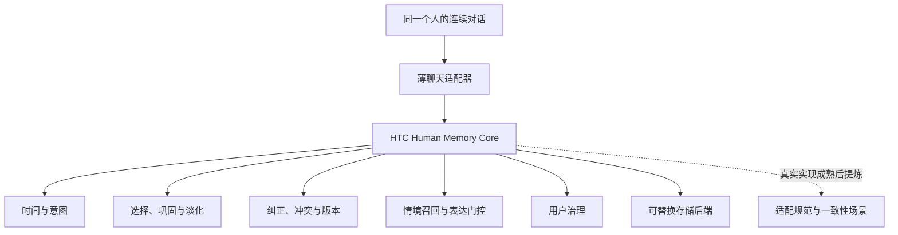

# 产品定义：Human Temporal Continuity

> 状态：产品定义 0.3（待批准）
>
> 日期：2026-07-21
>
> 当前方向：Human Memory Core + 薄聊天适配器

## 1. 一句话定义

Human Temporal Continuity（HTC）是一个可复用的“人类式记忆核心”：它让个人 AI 能够理解同一个人在时间中的经历、变化、意图和意义，并以选择性、可纠正、克制且合时宜的方式记住和想起。

它不是重新造陪伴聊天产品，而是定义并实现这些产品都需要的“人类式记忆核心”。

## 2. 产品使命

HTC 希望让用户在长期使用 AI 时产生一种朴素但稀缺的感受：

> 它知道现在是什么时候，也知道我说的是哪个时候；它记得真正影响我的事，但不会把我记录、分析或定型。

“记忆成功”不等于保存了更多文本，而是让 AI 在新的对话中仍然正确理解：

- 这是同一个人；
- 过去发生过什么，以及那件事为何重要；
- 哪些只是当时的情绪，哪些是较稳定的事实或偏好；
- 哪些事情仍未完成，哪些已经完成、取消或结果未知；
- 什么内容此刻有帮助，什么内容即使相关也不应主动说出口。

## 3. 产品问题

现有 AI 记忆系统通常擅长保存、摘要和检索，却不一定具备人类所期待的连续理解。典型失败包括：

1. 把“明天继续”保存成静态文本，几周后仍称其为“明天”。
2. 因为计划日期已经过去，就擅自认为事情已经完成。
3. 用户已经纠正事实，系统仍从旧摘要或检索结果中复述错误版本。
4. 用户某晚说“我最近很难过”，系统从此把“长期低落”当作人格标签。
5. 记得一段敏感往事，却在不合适的话题和时机主动翻出来。
6. 保存了大量聊天细节，却忘记真正持续影响用户的经历和未完成意图。
7. 把“长期记忆”误解为永久保存全部聊天记录。
8. 将记忆逻辑写死在某个 Agent、Skill 或供应商 API 中，无法复用。
9. 把测试台词、引用、假设或角色扮演误记成用户现实中的事实或计划。
10. 只沿用上一轮强烈的语境，忽略新的可信时钟和现实活动，因而对“现在”作出过期判断。
11. 为了证明系统记得，反复解释内部状态或主动翻出用户已经要求不要提起的内容。

这些失败不能只靠更大的上下文窗口或更好的向量检索解决。它们需要一个负责时间、选择、修正、淡化和表达边界的记忆核心。

## 4. 产品定位与层次

HTC 采用“核心优先、体验验证、标准后置”的层次：

1. **人类记忆语义**：定义什么叫正确、克制、连续地记住一个人。
2. **Human Memory Core**：实现时间理解、记忆选择、演化、召回和治理。
3. **个人聊天参考体验**：验证用户是否真的感到被持续理解。
4. **适配器与标准提炼**：在真实实现成熟后，再提炼跨 Agent、跨后端的一致性要求。



第一阶段的产品本体是核心，不是聊天 UI，也不是存储协议。聊天是第一块试金石，因为它能最直接暴露“记得但不懂”“记错时间”和“想起得不合时宜”等问题。

## 5. 第一参考用户与场景

第一参考用户就是一个长期与 AI 交流的个人，而不是企业、团队或多租户平台。

这个人会在不同时间与 AI：

- 倾诉最近的难过和内耗；
- 回忆过去的关系、选择或遗憾；
- 解释某段经历为何仍影响自己；
- 深夜工作后说“太晚了，明天再做吧”；
- 几天后继续原来的事情，或彻底改变计划；
- 纠正 AI 对事实、时间或自己感受的误解。

第一参考体验必须证明，AI 不只“查到旧消息”，而是在当前时刻正确理解过去、现在和未来意图之间的关系。

## 6. 核心体验承诺

### 6.1 时间连续

所有相对时间表达都绑定当时的时间锚点、时区、精度和不确定性。时间流逝后，系统使用面向当前时刻的表述，而不是机械复述旧词。

### 6.2 结果诚实

计划不等于事实，预期时间过去不等于事情发生。没有完成证据时，结果必须保持未知。

### 6.3 情绪不固化

一次难过、愤怒或自我怀疑首先是有时间范围的经历或状态，不自动升级为长期人格结论。只有用户长期、重复且明确支持时，系统才能形成更稳定的概括，而且仍允许修正。

### 6.4 记住意义但不诊断

系统可以记住用户明确表达或上下文直接支持的意义，例如“那次失败让我现在很怕再次开始”。它不能擅自生成心理诊断、人格标签或因果定论。

### 6.5 选择性记忆

HTC 默认少记。普通细节会淡化、压缩或不写入；真正影响未来理解、选择和未完成事项的内容获得更高保留价值。

### 6.6 适时想起

“内部召回”和“主动说出口”是两次独立判断。一段敏感往事可以帮助理解当前语境，但不一定适合被直接提起。

### 6.7 可纠正、可治理

用户的明确纠正优先。用户能够查看、修改、降级、固定、禁止主动提起和删除记忆。

### 6.8 自然且不打扰

记忆机制默认不可见。系统先回应用户此刻真正表达的内容，只在高影响歧义、显式治理请求或会改变答案的纠正出现时，用自然语言确认一个关键分歧。它不以字段、置信度或“我会记录为”播报代替正常交流。

## 7. Human Memory Core 的职责

核心围绕一条持续循环工作：

```text
观察 -> 时间定位 -> 理解候选意义 -> 决定是否记住
     -> 与已有记忆整合 -> 随时间演化
     -> 按当前情境召回 -> 判断如何表达
     -> 接受纠正与反馈
```

聊天适配器提交的是原始观察或带来源的“不可信候选”，不是已经成立的记忆。模型可以提出时间解析、意义和相关性候选；是否写入、是否持久、如何转移状态、能否召回和删除哪些派生内容，最终由核心及其确定性策略决定。

### 7.1 话语作用域

- 对每个候选命题判断它是在陈述现实，还是测试、引用、假设、角色扮演或无法确定的话语；同一条消息可以混合多种作用域；
- `test / quoted / hypothetical / roleplay` 命题默认只服务当前上下文，不能静默创建它所描述的现实记忆或意图；
- 无法可靠区分且后果较大时，只问一个符合当前语境的自然问题；
- 用户澄清后立即修正作用域，并使基于错误作用域产生的对象与召回结果失效。

### 7.2 时间定位

- 解析“今天、昨晚、明天、那几年、最近”等表达；
- 保存原始表达与当时锚点；
- 区分事件发生、系统得知、计划预期和事实有效的时间；
- 面向当前时刻重新表述过去的相对时间；
- 保留精度和不确定性，不擅自补齐日期；
- 同时维护可信的民用日历时间和证据驱动的生活片段，不用其中一个冒充另一个。

### 7.3 记忆准入

核心决定一个对话片段是：

- 仅用于当前上下文；
- 候选记忆，等待更多证据；
- 应保留的经历、事实、意图或偏好；
- 敏感且需要用户确认后才能保留；
- 不应写入长期记忆。

情绪强度本身不是永久保存授权。

### 7.4 整合与巩固

- 将重复经历连接起来，但不急于得出稳定人格结论；
- 把多个细节压缩为有来源、可回溯的克制总结；
- 区分当前事实与历史事实；
- 让新的明确纠正使旧结论失效；
- 在证据不足时保留冲突或未知，而不是静默猜测；
- 让更精确的新证据取代概略表述的当前投影，同时保留两者的来源；
- 将 ASR 转写错误作为同一实体的已撤回别名修正，不因拼写变体创建重复实体。

### 7.5 淡化与遗忘

遗忘是核心行为，不是故障。它可以表现为：

1. 降低主动召回概率；
2. 从活跃记忆转为休眠；
3. 将细节压缩为更概括的意义；
4. 归档并默认不参与对话；
5. 按用户要求物理删除。

衰减不能只由经过时间决定，还应考虑重要性、重复提及、未来影响、用户反馈、敏感性和纠正历史。

### 7.6 情境召回

召回至少考虑：

- 当前话题与用户意图；
- 涉及的人、地点、项目和时间范围；
- 未完成事项；
- 当前有效性与版本；
- 重要性、置信度和敏感性；
- 最近是否已经提过，避免机械重复。

### 7.7 表达门控

召回后必须再次判断：

1. 这条记忆是否真的有助于当前理解或回答？
2. 主动提起是否必要、合时宜且符合用户预期？
3. 应直接陈述、温和暗示、先确认，还是只用于内部理解？

默认不炫耀记忆，不用个人历史装饰每次回答，不在工作话题中突然翻出敏感经历。

用户禁止主动提起某条内容后，限制从当前轮立即生效。历史上的敏感或高风险信息可以提高内部谨慎度，但不能使每次普通的疲惫、生气或难过都触发同一敏感话题；只有新的、明确且当前相关的证据才能重新进入相应确认流程。

### 7.8 用户治理

核心应支持：查看来源、纠正、降级重要性、固定、禁止主动提及、删除和导出。系统推断必须与用户亲口陈述区分。

## 8. 核心记忆对象

第一版只需要五类语义对象，不先承诺最终存储 Schema：

| 对象 | 表达什么 | 例子 |
| --- | --- | --- |
| 经历 `Episode` | 在某段时间发生或被回忆的事情 | “去年离职后有一段很迷茫的时期” |
| 事实/状态 `State` | 在某个有效期内为真的情况 | “从六月开始住在示例城市” |
| 意图 `Intention` | 面向未来但尚未证实完成的事项 | “太晚了，明天再做” |
| 意义 `Meaning` | 用户明确表达或直接支持的影响 | “那次失败让我现在很怕重新开始” |
| 模式 `Pattern` | 经多次证据支持的稳定偏好或倾向 | “更喜欢先讨论清楚再动手” |

每个对象都应保留足以支持下列判断的信息：

- 内容与主体；
- 来源与证据；
- 置信度与敏感性；
- 发生、得知、预期、有效和记录时间；
- 当前状态与结果是否已知；
- 重要性、活跃度和表达限制；
- 被哪条纠正或替代；
- 何时需要重新评估。

这是一组语义要求，不是要求所有后端使用相同字段或数据库结构。

原始观察还必须独立保留话语作用域：`actual / hypothetical / quoted / roleplay / test / uncertain`。只有 `actual`，或经用户确认后转为 `actual` 的观察，才有资格产生现实世界中的长期对象；话语作用域不是五类记忆对象中的第六类。

第一里程碑只实现 `Episode`、`State`、`Intention` 和用户明确表达的 `Meaning`。自动创建 `Pattern`、自动强化、自动淡化和自动巩固后移；它们仍属于产品方向，但不进入第一次体验验证。

### 8.1 对象关系与状态

- `Intention` 完成后仍是意图对象，并链接完成证据；它可以关联一个结果 `Episode` 或 `State`，但不能静默变成它们。
- 旧事实曾经成立时，通过关闭有效期变为历史事实。
- 旧事实从未成立时，标记为 `retracted`，不能伪装成历史真相。
- 新事实取代旧的当前事实时使用 `superseded` 并保留来源链。
- 证据不足的冲突进入 `disputed`，不能静默选择一个版本。
- 对纠正的再次纠正继续追加 lineage，不直接抹掉中间过程。

```text
认知状态：candidate / current / superseded / retracted / disputed
意图状态：planned / active / waiting / paused / completed / cancelled
结果认知：known / unknown
```

第一里程碑的意图状态转换：

| 操作 | 前置条件与证据 | 结果 | 历史处理 |
| --- | --- | --- | --- |
| 创建 | E1 用户陈述，时间已锚定或明确标记未解析 | `current + planned + unknown` | 新建意图并链接来源 |
| 开始 | 当前为 planned/paused；E1 陈述或可信工具证据 | `current + active + unknown` | 追加转换证据 |
| 等待/暂停 | 当前为 planned/active；E1 陈述 | `current + waiting/paused + unknown` | 追加转换证据 |
| 改期 | 当前非终态；E1 新预期时间 | 保留当前意图与原状态，结果仍未知 | 追加 schedule revision 并保留旧日期；目的变化时取消旧意图并新建关联意图 |
| 完成 | 当前非终态；E1 陈述或可信工具证据 | `current + completed + known` | 追加完成证据，可关联结果经历/状态 |
| 取消 | 当前非终态；E1 陈述 | `current + cancelled + known` | 追加取消证据 |
| 争议（非终态） | 非终态存在相互冲突且可追溯的证据 | `disputed + 原非终态 + unknown` | 同时保留两方陈述 |
| 争议（终态结果） | completed/cancelled 结论受到可信反证 | 权威投影回到最近一个无争议的非终态（没有则 planned）并保持 unknown；终态结论只作为 disputed evidence | 保留双方证据并使依赖终态结论的召回包失效 |
| 纠正错误记录 | 用户明确说明旧对象从未为真 | 旧对象变为 retracted；如提供正确内容则创建新当前对象 | 使派生对象和召回包失效并链接纠正 |
| 纠正历史变化 | 用户说明旧 State 曾经为真但后来变化 | 关闭旧有效期并创建/替代当前 State | 同时保留历史与当前事实 |
| 纠正经历/意义 | 用户纠正 Episode/Meaning 的时间、内容或意义 | 部分有效则 superseded，否则 retracted；创建正确对象 | 使派生对象和召回包失效，只从有效来源重算 |
| 纠正一次纠正 | 用户再次明确纠正上次纠正 | 新纠正取代/撤回上次纠正 | 不自动复活更早对象，除非用户明确重新确认 |
| 撤回对象/来源 | 用户治理操作或来源被可靠撤回 | 对象变为 retracted，不再参与当前召回 | 级联失效派生对象、索引、轨迹和活跃召回包 |

`completed` 和 `cancelled` 在第一里程碑中是终态；再次开始会创建关联的新意图。`completed/cancelled + unknown`、`planned/active/waiting/paused + known` 和 `retracted + current` 都是非法组合。

### 8.2 情绪意义的证据阶梯

| 等级 | 证据 | 可以形成什么 |
| --- | --- | --- |
| E0 | 模型推断，没有直接文本支持 | 只作为当前轮假设，不形成持久意义 |
| E1 | 用户一次直接陈述 | 经历、事实、意图或用户明确表达的意义 |
| E2 | 多次独立且直接支持的观察 | 候选模式，但不能形成身份标签 |
| E3 | 用户明确确认稳定解释 | 可持久的模式或身份相关偏好，仍允许纠正 |
| T1 | 宿主证明的工具结果，包含认证操作 ID 和不可变来源 | 只证明外部可观察事件/结果，不能证明主观意图或意义 |

一次难过在 E1 只能是有时间范围的 `Episode` 或 `State`。重复本身也不能产生诊断或身份定论。

没有宿主证明的外部结果仍是 E0 候选。用户对自己的意图、主观经历和明确意义拥有最高解释权；T1 可以支持外部可观察结果，但与用户陈述冲突时进入 disputed，不允许任一来源静默覆盖另一方。

### 8.3 纠正、精度与实体归一

- 用户明确纠正优先于模型、ASR、旧摘要和检索结果；
- 后来的精确日期可以取代较早的概略时长作为当前计算依据，但概略说法仍作为带来源的历史表达保留；
- 计划入职、可能发生或约定发生的日期，不能因为日期精确就升级成实际经历；
- 后续表达可以提高或降低未来事项的置信度，而不删除先前证据，也不自动升级成已确认计划；
- 用户确认的实体拼写成为规范名称；已确认是转写错误的同音变体标记为 `retracted alias`，不得产生新人物或新组织；
- 纠正会使依赖旧值的派生对象、索引和活跃召回包失效，并从仍有效的来源重新计算。

## 9. 时间与未完成意图

### 9.1 必须区分的时间

| 时间 | 含义 |
| --- | --- |
| `event_time` | 事件实际发生或被描述发生的时间 |
| `learned_at` | 系统得知这件事的时间 |
| `anchor_time` | 相对时间表达所依赖的对话时刻 |
| `expected_at` | 计划或预计发生的时间 |
| `valid_from / valid_to` | 一个事实或状态的有效区间 |
| `recorded_at / updated_at` | 系统记录和修改记忆的时间 |
| `calendar_time` | 由可信宿主时钟提供的当前民用日期、时刻和时区 |
| `lived_episode` | 由活动与结束证据界定、可能跨越日历边界的连续生活片段 |

这些时间不能合并成一个含糊的 `timestamp`。

`calendar_time` 回答“客观上现在是什么时候”；`lived_episode` 回答“用户是否仍处于同一段尚未结束的经历”。跨过午夜只改变前者，不能自行证明用户已经睡眠、恢复、完成事项或进入新的生活片段。

生活片段只能由证据推进或关闭，例如用户明确说已经睡醒、离开、完成活动，或可信工具证明发生了不相容的新活动。新的现实活动足以淘汰旧的“当前场景”，但不能补造中间细节：用户已经完成次日工作可以证明深夜场景不再是现在，却不能证明具体几点入睡。

`lived_episode` 是面向当前交互的运行时投影，不是第六类持久记忆对象。连续对话和明确的“仍然、刚才、接着”等证据可以延续它；长时间空白或新 turn 本身不会证明旧片段已经结束，但在缺少连续证据时，旧片段不得继续被投影为“现在”，其结束方式保持未知。

### 9.2 “明天再做”的完整语义

假设用户在 `2026-07-18 23:40 Asia/Shanghai` 现实地决定：

> 太晚了，明天再做吧。

系统应形成一个未完成意图：

```yaml
type: intention
content: 继续当前工作
original_expression: 明天再做
anchor_time: 2026-07-18T23:40:00+08:00
expected_at: 2026-07-19
status: planned
outcome: unknown
```

形成该意图的前提是话语作用域为 `actual`。如果同一句话出现在产品测试、引用或角色扮演中，系统不得创建真实计划；语境仍不足时，应先自然确认它是在测试行为还是真的决定明天继续。

随后：

- 7 月 19 日可以理解为“今天计划继续”；
- 7 月 20 日若没有新证据，只能说“原计划昨天继续，目前结果未知”；
- 用户说“做完了”后才转为 `completed`；
- 用户说“不做了”后转为 `cancelled`；
- 用户改变日期时更新预期，不伪造历史。

### 9.3 意图状态

```text
planned / active / waiting / paused / completed / cancelled
```

“是否逾期”和“结果是否已知”是独立维度。一个意图可以同时是“预期时间已过”和“结果未知”。

## 10. 情绪记忆边界

情绪场景是第一版的高风险核心，而不是附加功能。

### 10.1 可以保留

- 用户明确描述的经历；
- 当时的感受及其时间范围；
- 用户明确说明的长期影响；
- 用户希望以后被理解或记住的内容；
- 多次出现、确实影响建议方式的稳定偏好。

### 10.2 默认不能保留为稳定结论

- 从一次情绪推断人格；
- 未经用户支持的心理诊断；
- “你总是”“你就是”式永久标签；
- 对关系动机、创伤原因或精神状态的自信猜测；
- 只因为内容强烈就永久保存敏感细节。

### 10.3 召回方式

优先使用低侵入表达，例如：

> 你之前提过类似的担心。如果现在仍然相关，我们可以从那里继续。

而不是：

> 因为你过去那段关系造成了创伤，所以你现在一定是在逃避。

### 10.4 敏感性与同意

“允许持久保存”“允许跨会话内部召回”和“允许主动说出口”是三个不同权限。

| 类别 | 示例 | 持久写入 | 跨会话内部使用 | 主动表达 |
| --- | --- | --- | --- | --- |
| 普通 | 工作偏好、项目上下文 | 允许，必须可查看/删除 | 允许 | 相关时允许 |
| 个人 | 关系、普通情绪经历 | 遵循用户总记忆偏好 | 相关时允许 | 温和且可禁止 |
| 敏感 | 创伤、健康、性、精确财务/法律、第三方隐私 | 明确同意或用户明确要求记住 | 仅限已同意写入，且最小化内容 | 默认禁止，先确认 |
| 禁止 | 密码、API Key、认证秘密 | 永不写入 | 永不使用 | 永不表达 |

在当前对话中使用用户刚说的内容，不等于获得跨会话持久保存许可。

同意设置按“用户默认 → 类别 → 单条对象”继承，越具体的设置优先；同级冲突时拒绝优先。撤回同意立即生效，可以只撤回跨会话召回或主动表达，而不必删除对象。

“不要主动提起”属于立即生效的表达权限撤回，而不是普通偏好。它必须使当前生成中的旧授权失效；系统仍可在获准范围内内部理解，但不得为了展示记忆能力而提及来源、敏感类别或相关推断。

第三方私密内容默认不持久保存，即使主要用户已经开启个人记忆。核心应优先保存以用户为中心的最小抽象，例如“这个家庭话题很敏感”，而不是第三方细节。例外需要明确必要性和单条确认；第三方认证秘密始终禁止。

敏感分类是可替换能力，必须输出类别、置信度、理由和歧义候选。低置信度或边界情况升级到更严格类别；不允许在不确定时静默按普通内容写入。

主动表达授权分四级：P0 没有询问记忆；P1 只是在相邻话题；P2 泛问“你记得我什么”；P3 直接点名具体经历。敏感内容只有在 P3 或存在未撤回的单次/单对象表达同意时才能透露细节；P2 最多说明存在某类敏感记忆。

删除请求在返回成功前必须完成逻辑失效、召回撤销和最终输出阻断。主记录、派生对象、索引、缓存和含内容轨迹在 24 小时内物理清除；加密备份最多保留 30 天，恢复时必须先应用 tombstone。审计 tombstone 只保留对象 ID、时间和无内容原因码。已经发送给用户的文本无法撤回，产品必须明确说明这一限制。

## 11. 架构边界

### 11.1 Human Memory Core

核心拥有：时间语义、记忆准入、对象演化、纠正、巩固/淡化、召回排序、表达门控和用户治理。

关键不变量必须由确定性策略执行：时间锚定、结果状态、纠正优先级、同意、删除和敏感表达限制。模型只能提供候选解析、候选意义、证据抽取和相关性建议；模型与策略冲突时策略优先。

### 11.2 薄聊天适配器

适配器只负责：

- 提供当前对话、用户身份、每轮刷新后的可信当前时间和时区；
- 在回答前请求一份受约束的召回结果；
- 将召回结果作为隐藏上下文交给模型；
- 在回答后把新的候选经历、事实、意图和反馈交给核心；
- 暴露“记住、纠正、忘记、不要主动提起”等用户操作。

适配器不能自行发明长期记忆语义，也不能成为唯一的数据和规则载体。

### 11.3 最小概念契约

具体 JSON 或语言类型留给工程设计，但第一适配器之前必须固定以下概念接口：

- `ObserveRequest`：用户与会话标识、原始消息、可信发生时间（如有）、接收时间、时区提示、来源和显式记忆操作；
- `ObserveResult`：话语作用域，接受、拒绝或需要确认的对象，状态变化、来源和原因码；
- `RecallRequest`：用户、当前问题、用途、当前时间、时区和召回预算；
- `RecallPackage`：规范化内容、类型、时间框架、当前生活片段、来源、置信度、敏感性、允许用途、禁止用途和过期时间；
- `OutputCheckRequest / Result`：用草稿、该次生成收到的全部召回项、当前轮或系统摘要中传入模型的全部策略相关敏感片段/候选、prompt authorization level、package version 和 revocation token 检查是否允许、应抑制还是重新生成；不能相信模型自行声明使用了哪些输入；
- `GovernanceRequest`：查看、纠正、撤回、删除，或按用户/类别/对象分别设置与撤回持久化、跨会话内部召回、主动表达同意，并记录生效时间。

召回包必须短期有效且绑定用途，不能被适配器跨话题重复使用。

### 11.4 信任边界

本地参考实现由已认证的宿主/运行时提供用户身份、接收时间、会话时区和不可变 turn ID。只有宿主元数据中的消息发生时间可以被直接信任；用户文本、模型提议、适配器提示和外部后端结果都是带来源的不可信输入。

无法证明来源的元数据降级为提示并触发保守策略。参考适配器属于可信计算基：必须使用用途绑定的召回包、调用最终输出授权并服从撤销。恶意绕过核心的宿主不在强制保证范围内，并被定义为不符合 HTC；适配器一致性测试必须暴露这一限制。

### 11.5 时间锚定策略

- 每个新 turn 都从可信宿主刷新 `calendar_time`，不得用历史摘要中的“现在”覆盖新时钟；
- 可信的消息发生时间优先作为相对时间锚点，接收时间单独保留；
- 延迟或重放的消息缺少可信发生时间时，标记不确定，并在持久化日期敏感意图前确认；
- 时区优先级为：消息显式时区、可信会话时区、带来源的用户档案时区、未解析；
- 不使用 UTC 静默替代用户的民用日期；
- 保存 IANA 时区，以处理旅行和夏令时；
- “临近午夜的明晚”等表达保留完整锚点、时区、精度和歧义；
- 缺少 locale 或时间信息时不得伪造精度；
- 日历翻页不关闭 `lived_episode`；新活动证据可以刷新当前片段，但不推断未观察到的过渡过程。

### 11.6 保守失败策略

- 时间置信度低：保留歧义，必要时询问，不建立未经确认的日期敏感持久意图；
- 话语作用域不确定：对高影响写入先确认；低影响内容只留在当前上下文；
- 来源缺失：不升级为持久记忆或当前事实；
- 召回包过期：拒绝使用并重新召回；
- 模型或后端不可用：不新增持久记忆，不编造完成或纠正结果；
- 策略冲突：采用更严格的敏感性和表达结果；
- 草稿可能泄露敏感记忆：返回前抑制或重新生成；
- 生成期间发生删除或同意撤回：交付前再次比较 package version 和 revocation token，丢弃基于旧授权生成的内容；
- 当前时钟或现实活动比召回包更新：使旧“当前场景”失效并重新召回。

输出检测器独立检查逐字、改写、隐式和“只透露敏感类别”式泄露。检测本身是概率能力，但一旦触发，抑制/重新生成动作必须是确定性的。第一里程碑要求明确禁止案例检出率 100%，对抗性改写/隐式案例至少 95%，并且两个端到端参考轨迹中实际交付的禁止输出为零。

### 11.7 可替换后端

SQLite、文件、Mem0、Graphiti、MemOS 或其他后端负责持久化和查询。后端可以提供额外能力，但不能决定 HTC 的时间、纠正和表达语义。

### 11.8 模型与 Agent

Hermes 可以作为第一集成目标，但 HTC 的概念和核心不能依赖 Hermes。Codex、Claude 或自定义聊天应用应能通过相同的核心边界接入。

## 12. 第一阶段产品：Reference Experience

第一阶段交付一个本地 Human Memory Core 服务、负责最终输出授权的可信集成中间层，以及一个可运行的垂直切片，而不是完整生态：

- 一个本地运行的 Human Memory Core；
- 一个简单、可替换的本地存储后端；
- 一个薄聊天适配器；
- 一组以真实多日对话为单位的场景测试；
- 一个最小的记忆检查与纠正入口；
- 记录“为什么写入、为什么召回、为什么没有说出口”的可解释轨迹。

第一版不要求漂亮的陪伴聊天 UI。现有聊天运行时可以承载体验，HTC 只验证记忆行为。

调试轨迹可以解释内部决策，但正常聊天默认只呈现自然回答。内部可解释性不能演变成面向用户的逐轮数据库播报。

第一里程碑只以两个跨多日轨迹为验收范围：

1. 深夜说“明天再做”之后的时间和意图变化；
2. 过去经历、当前情绪和敏感表达边界之间的连续理解。

它必须提供最小的文本或命令治理入口，支持查看、纠正/撤回、禁止主动提起和删除。导出、自动 Pattern、自动强化/淡化/巩固、漂亮 UI 和广泛适配不进入第一里程碑。

## 13. 首批验证场景

### 场景 A：过去与当下的情绪连续性

用户多次谈到一段过去经历。系统能理解它对当前选择的影响，但不会在无关场景主动提起，也不会把某次低落固化为人格标签。

### 场景 B：深夜的“明天再做”

系统把“明天”绑定到当时日期，持续跟踪未完成意图；时间过去后不误报完成，并能接受完成、取消或改期证据。

### 场景 C：事实变化与纠正

用户搬家、换工作或纠正日期后，旧事实成为历史而不是当前事实；后续回答不复发旧结论。

### 场景 D：选择性记忆与淡化

普通细节逐渐退出活跃记忆，反复影响用户选择的经历得到巩固；用户可以查看这种变化并进行干预。

### 场景 E：相关但不应说出口

敏感记忆可以帮助模型理解当前问题，但通过表达门控被隐藏、改为确认式表达，或完全不使用。

### 场景 F：话语作用域与现实准入

测试、引用、假设和角色扮演中的第一人称陈述不会静默成为现实记忆；真正的未来预期可以调整置信度，但在获得确认前仍不是确定计划。

### 场景 G：日历时间与生活片段

跨午夜不会自动推断睡眠、恢复或事项结束；新的可信时钟和现实活动会及时淘汰过期的“当前场景”，同时保留未知的中间过程。

### 场景 H：精确信息与实体纠正

精确日期取代概略时长的当前投影但保留来源；ASR 拼写纠正更新同一实体，不创建重复人物。

场景 A 和 B 是第一里程碑的两条端到端验收主线；场景 C 至 H 作为同一里程碑的聚焦回归案例，不扩展成完整生态功能。在它们通过之前，不宣称已经形成广泛可复用的记忆核心。

`docs/multi-day-reference-traces-2026-07.md` 中的 T01 至 T09 是本定义 0.3 的可执行式行为伴随文档；实现可以不同，但不得违反其中的允许表达与禁止行为。

## 14. 成功标准

第一阶段不以“存了多少条记忆”衡量。两个验收轨迹必须写成 Given/When/Then，并为每一步标明预期记忆状态、允许表达、禁止表达、来源和同意状态。

可观察断言至少包括：

- “明天”使用可信发生时间和时区；无法解析时，未经确认不得建立日期敏感的持久意图；
- 测试、引用、假设和角色扮演不会静默创建现实记忆或意图；
- 预期日期过去但没有完成证据时，`outcome` 仍为 `unknown`，任何“已经完成”的草稿被策略拒绝；
- 日历翻页不产生睡眠、恢复、完成或片段关闭结论；新可信活动可以淘汰旧当前场景但不补造中间过程；
- 精确日期和用户确认的实体拼写成为当前投影，概略来源与已撤回 ASR 别名仍可追溯；
- 完成、取消和改期都有可追溯证据，并只执行允许的状态转换；
- 一次低落只形成有时间范围的经历/状态，低于 E3 的身份模式被拒绝；
- 未获持久写入同意的敏感内容不会进入后续召回；
- 已获同意的敏感内容默认禁止主动表达，泄露草稿会被抑制或重新生成；
- 用户撤回主动表达许可后限制立即生效；普通负面情绪不会仅因历史敏感信息而重复触发敏感确认；
- 敏感分类评估集至少包含 20 个明确案例和 10 个边界案例；明确的敏感/禁止案例不能被降为普通，所有不确定边界案例必须请求确认；
- 输出策略评估覆盖来自召回、当前轮、候选和摘要的逐字、改写、隐式及类别泄露，并达到检测阈值；
- 用户可以通过最小入口查看、纠正/撤回、禁止主动提起和删除；
- 删除来源会使其派生意义、索引和活跃召回包失效；
- 生成期间发生删除或同意撤回时，最终授权会拒绝旧 package version/revocation token 产生的草稿；
- 每次写入和状态变化都有来源及原因码；
- 正常对话不逐轮播报记忆字段、状态或置信度。

第一适配器边界必须预先定义；第二适配器用于验证和修正该边界，而不是事后才创造边界。

## 15. 第一阶段不做什么

- 不重新开发完整陪伴聊天产品；
- 不永久保存全部聊天；
- 不自建向量数据库或通用知识图谱；
- 不做自动人格分析或心理诊断；
- 不把提醒器、日历或任务管理器本身当作 HTC；
- 不一开始支持所有 Agent 和所有后端；
- 不先发布一套庞大的跨实现标准；
- 不重新发明 MCP、memory CRUD 或数据交换协议。

## 16. 标准与一致性测试的后置路径

标准化仍然有价值，但它是从真实产品行为中提炼出来的第二阶段成果。

满足以下条件后再提炼 HTC Core Profile：

1. 个人聊天参考体验已经跑通；
2. 至少一组多日对话证明了核心语义的价值；
3. 至少两个适配器暴露了共同边界；
4. 已知哪些行为必须一致，哪些应允许产品自行决定；
5. 真实用户反馈证明“被持续理解”而不是“被监控”。

届时可以发布：

- 核心语义 Profile；
- 可观察的一致性场景；
- Agent 与后端映射；
- 导入导出和治理最低要求。

标准服务于核心的复用，而不是反过来让核心服务于标准。

## 17. 推荐实施顺序

1. 固化本产品定义及五类记忆对象。
2. 以匿名化多日参考轨迹固化话语作用域、双时间视图、纠正和表达边界。
3. 定义核心与聊天适配器之间的最小输入/输出契约。
4. 定义确定性策略与模型候选判断的责任表。
5. 实现本地核心与简单存储后端。
6. 接入一个聊天运行时，优先考虑 Hermes，但不形成依赖。
7. 通过第一里程碑后，再加入纠正、选择性淡化和“相关但不应说出口”验证集。
8. 由真实个人连续使用并记录误记、漏记、过度提及和时间错误。
9. 基于第二个适配器提炼可复用 Profile 和一致性测试。

## 18. 风险

### 18.1 “人类式”滑向伪心理学

应对：所有意义、模式和情绪结论都保留证据、置信度和时间范围；禁止诊断式推断。

### 18.2 记得太多造成监视感

应对：默认少记，敏感内容收紧准入，召回与表达分离，提供清晰治理入口。

### 18.3 核心被聊天适配器吞掉

应对：核心拥有完整语义和生命周期；适配器只转换上下文和调用核心。

### 18.4 只做体验导致无法复用

应对：从第一天保持核心边界独立，但暂不把未验证的设计冻结成标准。

### 18.5 标准化过早

应对：以两个适配器和真实对话证据作为提炼标准的进入条件。

### 18.6 敏感数据的本地安全

应对：第一实现至少要求逐用户访问隔离、静态加密或操作系统保护存储、诊断日志不记录秘密、lineage-aware 删除，以及明确的备份和删除行为。

## 19. 当前已锁定的决策

- HTC 是可复用的人类式记忆核心，不是新的陪伴聊天产品。
- 同一个人的个人多会话聊天是第一参考体验和设计权威。
- “人类式”表示选择性、时间感、可修正、会淡化、看语境召回，不表示模拟人脑。
- 情绪意义只在用户明确表达或上下文直接支持时保留，临时情绪不能固化为身份。
- 第一阶段采用 Human Memory Core + 薄聊天适配器。
- 标准与跨后端一致性是后续提炼路径，不是首个里程碑。
- Hermes 可以是第一集成目标，但不是概念依赖。
- 输入先区分现实陈述与测试、引用、假设和角色扮演；非现实话语不能静默进入现实记忆。
- 当前时间由可信宿主每轮刷新；`calendar_time` 与证据驱动的 `lived_episode` 是两种互补视图。
- 用户确认的精确信息与实体拼写优先，旧概略表达和 ASR 错误仍保留可追溯来源。
- 内部相关不等于允许主动表达；用户的表达限制立即生效，正常聊天默认不展示记忆机制。

## 20. 仍需在工程设计中回答

- 概念契约在首选语言中的具体类型和错误模型是什么？
- 时间解析、敏感分类和输出检查分别选用哪些可替换实现？
- 哪些敏感类别必须逐条获得用户同意？
- 如何用可解释轨迹帮助调试，同时不制造新的隐私风险？
- 最小记忆治理入口采用命令、文本界面还是简单 Web 视图？
- 第一聊天适配器最终选择 Hermes 还是更小的本地测试宿主？
